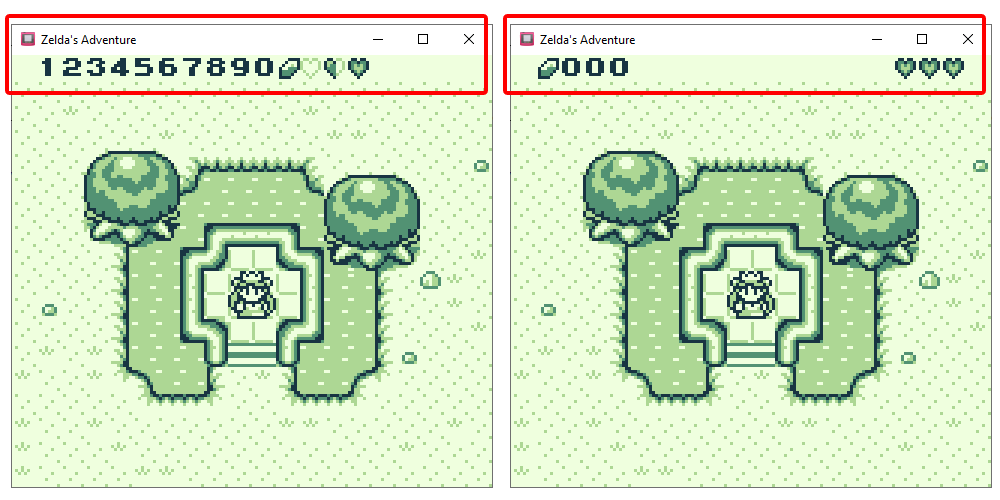
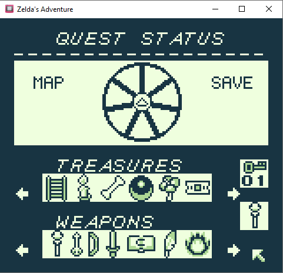

# GB Studio (for Zelda's Adventure)

A Fork of [GB Studio](https://github.com/chrismaltby/gb-studio) to facilitate the development of [Zelda's Adventure](https://github.com/john-lay/zeldas-adventure).

Initially forked from GB Studio [3.0.3](https://github.com/chrismaltby/gb-studio/releases/tag/v3.1.0) with the addition of a cherry pick of the [global variables in custom scripts](https://github.com/chrismaltby/gb-studio/pull/1143) feature.

## Features
* Custom HUD. Display Health and Rupee across the top of the screen
* Custom Inventory screen with scrolling carousel
* Swap projectile sprites on scene load. Allows Zelda to fire 19 different projectiles
* Animated tiles. e.g. water, lava, torches, etc.
* In the GB Studio editor, scenes snap to a 20px grid

There are 2 new scene types to accomodate these changes.
1. __Zelda's Adventure Template__ enables the HUD, animated tiles and custom projectiles
2. __Zelda's Adventure Inventory__ enables the scrolling inventory carousel

# Technical Details
## Accessing GB Studio variables in C

The modification relies on the ability to interrogate the GB Studio global variables and update the VRAM accordingly.

Thanks to [this issue](https://github.com/chrismaltby/gb-studio/issues/540), for highlighting global variables start at memory location `CC40`.

All the data is stored in banks 5 and 6.

## Installation
Clone this repo and follow the GB Studio [installation notes](https://github.com/chrismaltby/gb-studio/blob/develop/README.md#installation)

## Build
See [package.json](https://github.com/john-lay/gb-studio/blob/develop/package.json#L14-L17) for your preferrent OS

## Modifying spell data
[Convert png to C array and format using VS Code](https://github.com/john-lay/gb-studio/blob/develop/appData/src/gb/src/core/zeldasSpellData.c#L13-L22)
